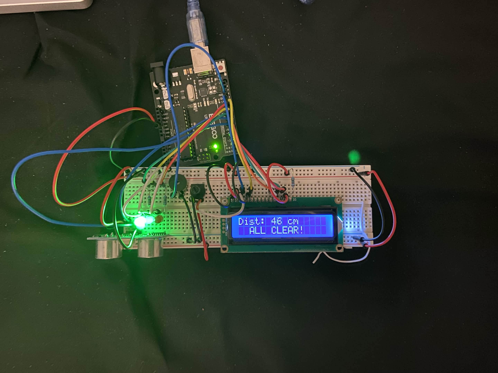
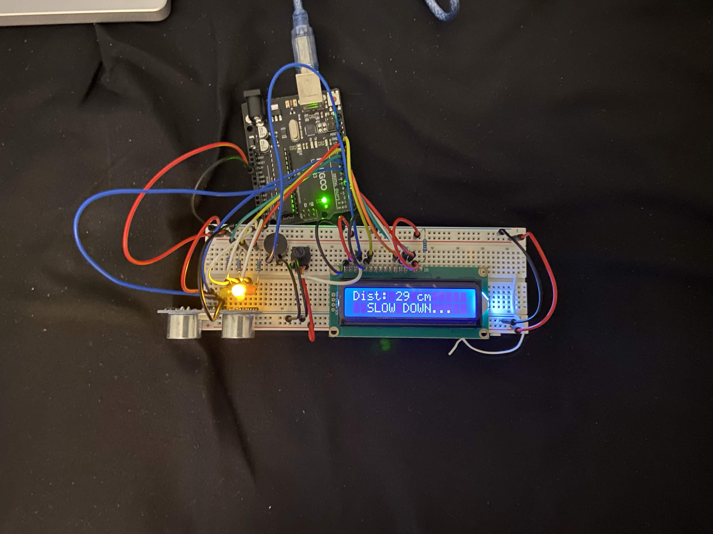
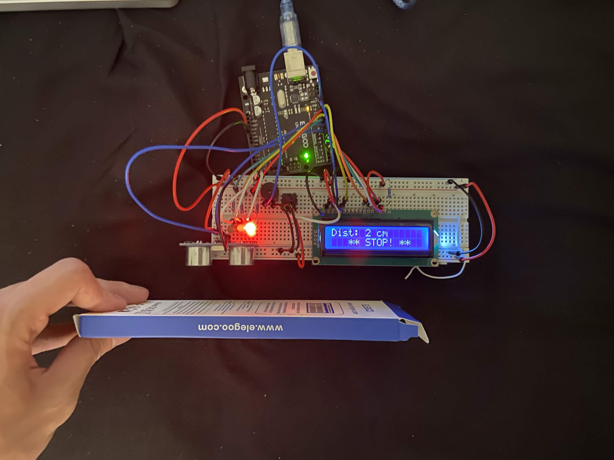

# UNO R3 Parking Sensor

A parking-assist distance sensor built on an Arduino UNO R3 for my CS 220 (Computer Architecture & Embedded Systems) capstone project. An HC-SR04 ultrasonic sensor measures distance to an approaching object in real time and reports status via a 16x2 LCD, a green/yellow/red LED indicator, and a piezo buzzer that beeps faster the closer the object gets — modeled after a car's parking sensor system.

## How it works

The HC-SR04 sends a pulse and measures the echo return time to calculate distance in cm. That distance is compared against three thresholds, each driving the LCD text, LED color, and buzzer beep rate:

| State | Distance | LCD Message | LED | Buzzer |
|---|---|---|---|---|
| All Clear | > 40 cm | `ALL CLEAR!` | Green | Silent |
| Slow Down | 20–40 cm | `SLOW DOWN...` | Yellow | Slow beep (600ms) |
| Caution | 10–20 cm | `CAUTION!!!` | Yellow + Red | Fast beep (250ms) |
| Stop | ≤ 10 cm | `** STOP! **` | Red | Very fast beep (80ms, near-solid tone) |

Distance readings are capped at 200cm for display stability, and the buzzer uses non-blocking timing (`millis()`) so the LCD and LEDs keep updating smoothly instead of pausing during beeps.

## Demo

| All Clear | Slow Down | Stop |
|---|---|---|
|  |  |  |

## Components

- Arduino UNO R3
- HC-SR04 ultrasonic distance sensor
- 16x2 LCD display (blue backlight)
- Green, yellow, and red LEDs
- Piezo buzzer
- Potentiometer (LCD contrast)
- 470Ω resistors (LEDs), 220Ω resistor (LCD backlight)
- Breadboard + jumper wires

## Wiring

| Component | Arduino Pin |
|---|---|
| HC-SR04 Trig | D7 |
| HC-SR04 Echo | D6 |
| LCD RS | D12 |
| LCD EN | D11 |
| LCD D4 | D5 |
| LCD D5 | D4 |
| LCD D6 | D3 |
| LCD D7 | D2 |
| Green LED | D8 |
| Yellow LED | D9 |
| Red LED | D10 |
| Buzzer | D13 |

## Code

See [`src/parking_sensor.ino`](src/parking_sensor.ino).

Core logic:
1. `getDistance()` — sends a 10µs trigger pulse, reads the echo pulse duration with `pulseIn()`, and converts it to centimeters using the speed of sound (0.0343 cm/µs, divided by 2 for the round trip)
2. `updateDisplay()` — prints the live distance and a status message on the LCD
3. `updateLEDs()` — sets the green/yellow/red LEDs based on which distance band the reading falls into
4. `updateBuzzer()` — adjusts beep interval (600ms → 80ms) as the object gets closer, using non-blocking `millis()` timing so the rest of the loop isn't held up

## What I'd improve next

- Average multiple sensor readings to reduce jitter
- Add a second ultrasonic sensor for dual-zone / wider-angle detection
- Enclose the electronics in a 3D-printed case for a cleaner build

## License

MIT
